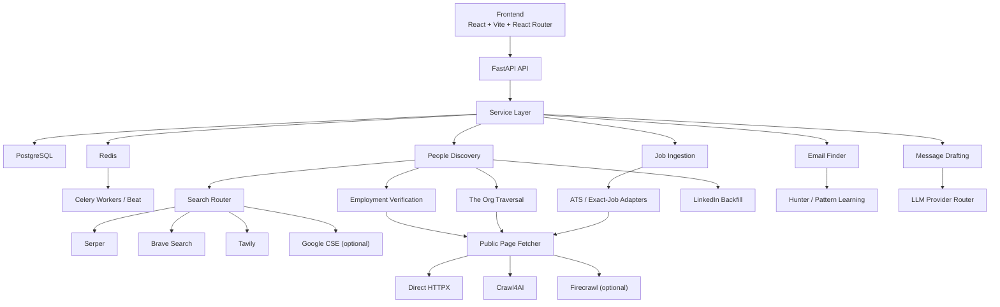
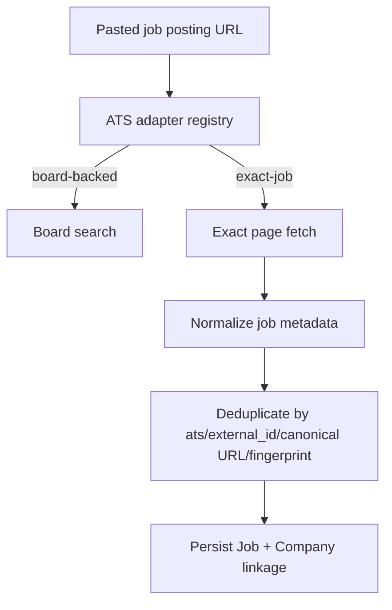
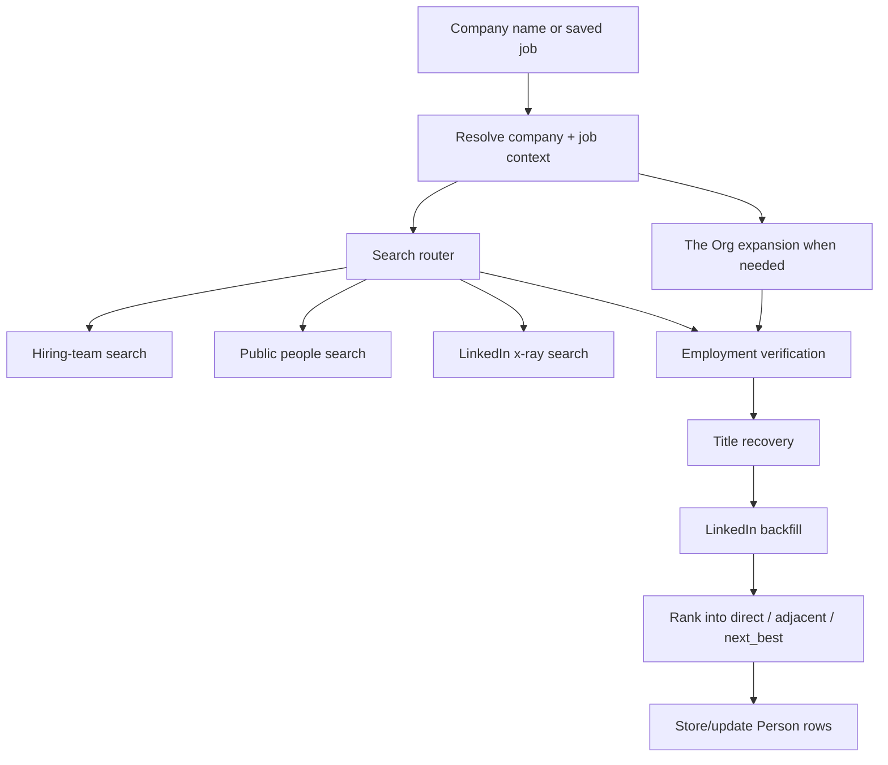

# NexusReach — Architecture

Last updated: 2026-03-22

This document describes the current implemented architecture, not the original greenfield plan.

## System overview



## Architectural style

NexusReach is a modular monolith:
- one FastAPI app
- one Postgres database
- one Redis instance
- background work through Celery

That remains the right tradeoff because the product is integration-heavy, data relationships are shared, and most complexity comes from retrieval/verification logic rather than scaling independent services.

## Frontend architecture

### Stack
- React 18
- TypeScript
- Vite
- React Router
- TanStack Query
- Zustand
- Tailwind CSS
- shadcn/ui on `@base-ui/react`

### Current page surface

```text
frontend/src/pages/
├── DashboardPage.tsx
├── JobsPage.tsx
├── LoginPage.tsx
├── MessagesPage.tsx
├── OutreachPage.tsx
├── PeoplePage.tsx
├── ProfilePage.tsx
├── SettingsPage.tsx
└── SignupPage.tsx
```

### Important frontend behavior
- TanStack Query owns server state.
- Zustand owns auth/session and other client-only state.
- The People page groups saved contacts by company and filters them by company name.
- Messages and Outreach reuse the same saved-contact company filter pattern.
- People cards render:
  - `match_quality`
  - `company_match_confidence`
  - email verification metadata
  - current-company verification metadata

## Backend architecture

### Router layer

```text
backend/app/routers/
├── auth.py
├── companies.py
├── email.py
├── insights.py
├── jobs.py
├── messages.py
├── notifications.py
├── outreach.py
├── people.py
├── profile.py
├── settings.py
└── usage.py
```

Routers remain thin. They validate input, resolve dependencies, and delegate to services.

### Service layer

Key current services:
- `job_service.py`
- `people_service.py`
- `employment_verification_service.py`
- `email_finder_service.py`
- `message_service.py`
- `api_usage_service.py`
- `theorg_discovery_service.py`

### Client layer

Key current clients:
- ATS/job clients:
  - `ats_client.py`
  - `jsearch_client.py`
  - `adzuna_client.py`
  - `remote_jobs_client.py`
- search clients:
  - `search_router_client.py`
  - `serper_search_client.py`
  - `brave_search_client.py`
  - `tavily_search_client.py`
  - `google_search_client.py`
  - `search_cache_client.py`
- enrichment/public fetch:
  - `apollo_client.py`
  - `proxycurl_client.py`
  - `github_client.py`
  - `public_page_client.py`
  - `crawl4ai_client.py`
  - `firecrawl_client.py`
  - `theorg_client.py`
- messaging/email:
  - `hunter_client.py`
  - `email_pattern_client.py`
  - `email_suggestion_client.py`
  - `llm_client.py`

## Core data model

### Company

The company model is now central to identity and email safety, not just enrichment.

Important fields:
- `name`
- `normalized_name`
- `domain`
- `domain_trusted`
- `public_identity_slugs`
- `identity_hints`
- `email_pattern`
- `email_pattern_confidence`

`public_identity_slugs` and `identity_hints` drive The Org traversal, slug repair, and company disambiguation.

### Job

Jobs are now stored in a way that supports both board-backed ATS and exact-job URLs.

Important fields:
- `external_id`
- `title`
- `company_name`
- `location`
- `url`
- `source`
- `ats`
- `ats_slug`
- `fingerprint`
- `match_score`
- `stage`

### Person

The person model now carries verification and email state, not just profile info.

Important fields:
- `full_name`
- `title`
- `linkedin_url`
- `work_email`
- `email_source`
- `email_verified`
- `email_confidence`
- `email_verification_status`
- `person_type`
- `profile_data`
- `source`
- `apollo_id`
- `current_company_verified`
- `current_company_verification_status`
- `current_company_verification_source`
- `current_company_verification_confidence`

Transient response-layer metadata also matters:
- `match_quality`
- `company_match_confidence`
- `fallback_reason`

## Job ingestion architecture

### Two-lane ingestion model

NexusReach now supports two job-ingestion lanes:

1. **Board-backed ATS search**
   - Greenhouse
   - Lever
   - Ashby

2. **Exact-job URL ingestion**
   - Workable
   - Apple Jobs
   - Workday exact-job URLs
   - generic exact-job hosts with parseable metadata

### Exact-job flow



### Important exact-job behaviors
- URLs are canonicalized before persistence.
- Workday exact-job fetch preserves metadata-rich HTML even when the visible body is thin.
- Workday outage or maintenance pages should fail cleanly instead of importing the wrong landing page.
- Generic exact-job ingestion is best-effort and only activates for direct `job_url` input.

## People discovery architecture

### High-level flow



### Search-provider router

The router exists to preserve Brave credits while keeping discovery quality stable.

Current provider responsibility matrix:

| Query family | Default order |
| --- | --- |
| Bulk LinkedIn people | `Serper -> Brave -> Google CSE` |
| Exact LinkedIn profile | `Brave -> Serper -> Google CSE` |
| Hiring-team search | `Serper -> Brave` |
| Public people | `Serper -> Brave -> Tavily` |
| Employment corroboration | `Tavily -> Serper -> Brave` |

Raw provider results are cached in Redis by:
- provider
- query family
- normalized params hash

### The Org traversal

The Org is a bounded second-stage expansion, not the only discovery path.

Current behavior:
- resolves org slugs from trusted `public_identity_slugs`
- validates org pages before trusting the slug
- caches preferred and rejected slug state in `identity_hints`
- traverses a limited number of org/team/person pages
- harvests recruiter, manager, and peer candidates
- keeps page metadata in `profile_data`

### Title recovery and LinkedIn backfill

After raw discovery:
- weak titles are repaired from snippets, public pages, or The Org
- verified public candidates without LinkedIn URLs get a second-pass exact-name/company LinkedIn lookup
- LinkedIn attachment is strict and precision-biased

### Ranking model

Current buckets are ranked in same-company order:
1. `direct`
2. `adjacent`
3. `next_best`

This replaced the older verified-only-empty-bucket behavior.

## Employment verification architecture

Current-company verification has two separate tracks:
- LinkedIn/public evidence verification
- role-fit ranking

Important rules:
- The Org/public identity can verify current company without trusting the email domain.
- Public verification source writes `public_web`.
- Legacy `firecrawl_public_web` remains readable for old rows.
- Team-page verification requires stronger evidence than person-page verification.

## Email architecture

### Email lookup pipeline

```text
stored email
-> Apollo enrichment (when available)
-> Hunter person/domain flow
-> Proxycurl/public fallbacks
-> learned-pattern or safe-domain best guess
-> not_found
```

### Safety rules
- best guesses are allowed only from approved domain signals
- ambiguous companies remain blocked from unsafe guessing
- email-domain trust is not inferred from public identity alone

## Message drafting architecture

- `llm_client.py` abstracts provider choice
- `NEXUSREACH_LLM_PROVIDER` selects Anthropic, OpenAI, Gemini, or Groq
- message generation is grounded in:
  - profile
  - job context
  - person context
  - outreach history

Draft creation and draft staging remain separate. NexusReach never auto-sends.

## Deployment and runtime assumptions

- Frontend is designed for Vercel or equivalent static hosting.
- Backend is designed for Railway or similar app hosting.
- Redis is used by both Celery and the search cache.
- Local development commonly runs with:
  - Postgres on `localhost:5432`
  - Redis on `localhost:6379`
  - frontend on `localhost:5173`
  - backend on `localhost:8000`

## Architecture truths worth preserving

1. Modular monolith is still the right shape.
2. Search routing should remain sequential, not fan-out, to control cost.
3. Company identity and email trust must stay separate.
4. Exact-job ingestion should prefer honesty over over-parsing.
5. Same-company fallback hierarchy is more useful than empty verified-only buckets.
