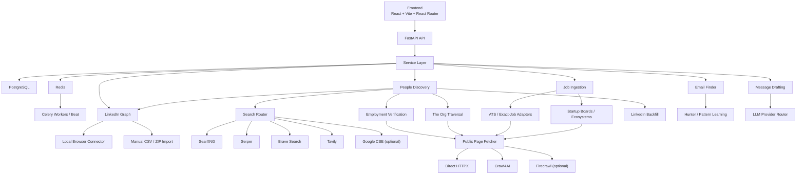
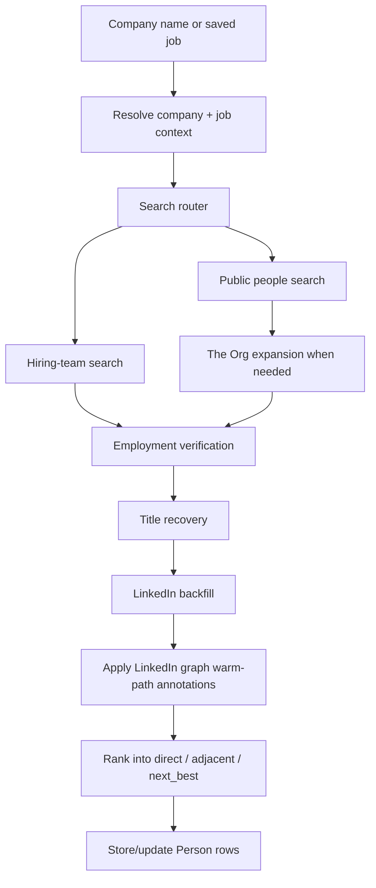
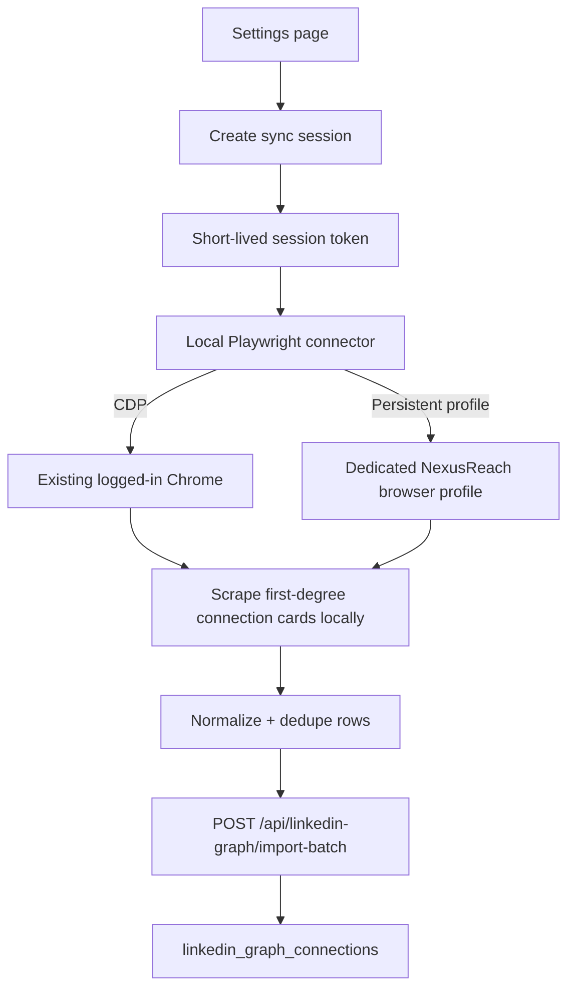

# NexusReach — Architecture

Last updated: 2026-04-04

This document describes the current implemented architecture, not the original greenfield plan.

## System overview



## Architectural style

NexusReach is a modular monolith:
- one FastAPI app
- one Postgres database
- one Redis instance
- background work through Celery

That remains the right tradeoff because the product is integration-heavy, data relationships are shared, and most complexity comes from retrieval/verification logic rather than scaling independent services.

## Frontend architecture

### Stack
- React 19
- TypeScript
- Vite
- React Router
- TanStack Query
- Zustand
- Tailwind CSS
- shadcn/ui on `@base-ui/react`

### Current page surface

```text
frontend/src/pages/
├── DashboardPage.tsx
├── JobsPage.tsx
├── LoginPage.tsx
├── MessagesPage.tsx
├── OutreachPage.tsx
├── PeoplePage.tsx
├── ProfilePage.tsx
├── SettingsPage.tsx
└── SignupPage.tsx
```

### Important frontend behavior
- TanStack Query owns server state.
- Zustand owns auth/session and other client-only state.
- The Jobs page now supports:
  - default discover
  - startup-only discover
  - a server-backed startup filter
  - a client-side country filter derived from `location`
- The People page groups saved contacts by company and filters them by company name.
- Messages and Outreach reuse the same saved-contact company filter pattern.
- People results can render:
  - `match_quality`
  - `company_match_confidence`
  - email verification metadata
  - current-company verification metadata
  - warm-path badges and explanations
  - a `your_connections` section for imported first-degree LinkedIn matches
- The Settings page exposes the LinkedIn graph status, import actions, sync-session creation, and local connector commands.
- Jobs, Job Detail, and Dashboard render startup badges/source labels from reserved job tags.

## Backend architecture

### Router layer

```text
backend/app/routers/
├── auth.py
├── companies.py
├── email.py
├── insights.py
├── jobs.py
├── linkedin_graph.py
├── messages.py
├── notifications.py
├── outreach.py
├── people.py
├── profile.py
├── settings.py
└── usage.py
```

Routers remain thin. They validate input, resolve dependencies, and delegate to services.

### Service layer

Key current services:
- `job_service.py`
- `people_service.py`
- `linkedin_graph_service.py`
- `employment_verification_service.py`
- `email_finder_service.py`
- `message_service.py`
- `api_usage_service.py`
- `theorg_discovery_service.py`

The local browser connector helper is implemented separately in:
- `backend/app/services/linkedin_graph_browser_sync.py`
- `backend/scripts/linkedin_graph_connector.py`

### Client layer

Key current clients:
- ATS/job clients:
  - `ats_client.py`
  - `jsearch_client.py`
  - `adzuna_client.py`
  - `remote_jobs_client.py`
  - `newgrad_jobs_client.py`
  - `yc_jobs_client.py`
  - `ventureloop_jobs_client.py`
  - `wellfound_jobs_client.py`
  - `conviction_jobs_client.py`
  - `speedrun_jobs_client.py`
- search clients:
  - `search_router_client.py`
  - `searxng_search_client.py`
  - `serper_search_client.py`
  - `brave_search_client.py`
  - `tavily_search_client.py`
  - `google_search_client.py`
  - `search_cache_client.py`
- enrichment/public fetch:
  - `apollo_client.py`
  - `proxycurl_client.py`
  - `github_client.py`
  - `public_page_client.py`
  - `crawl4ai_client.py`
  - `firecrawl_client.py`
  - `theorg_client.py`
- messaging/email:
  - `hunter_client.py`
  - `email_pattern_client.py`
  - `email_suggestion_client.py`
  - `llm_client.py`

## Core data model

### Company

The company model is central to identity and email safety, not just enrichment.

Important fields:
- `name`
- `normalized_name`
- `domain`
- `domain_trusted`
- `public_identity_slugs`
- `identity_hints`
- `email_pattern`
- `email_pattern_confidence`

### Job

Jobs support both board-backed ATS and exact-job URLs.

Important fields:
- `external_id`
- `title`
- `company_name`
- `location`
- `url`
- `source`
- `ats`
- `ats_slug`
- `tags`
- `fingerprint`
- `match_score`
- `stage`

### Person

The person model carries verification and email state, not just profile info.

Important fields:
- `full_name`
- `title`
- `linkedin_url`
- `work_email`
- `email_source`
- `email_verified`
- `email_confidence`
- `email_verification_status`
- `person_type`
- `profile_data`
- `source`
- `apollo_id`
- `current_company_verified`
- `current_company_verification_status`
- `current_company_verification_source`
- `current_company_verification_confidence`

Transient response-layer metadata also matters:
- `match_quality`
- `company_match_confidence`
- `fallback_reason`
- `warm_path_type`
- `warm_path_reason`
- `warm_path_connection`

### LinkedIn graph

Warm-path data is intentionally stored outside the CRM `Person` table.

Important persisted models:
- `LinkedInGraphConnection`
  - user-scoped connection record
  - normalized LinkedIn profile slug/URL
  - display name
  - headline
  - current company
  - normalized company identity
  - optional company LinkedIn URL/slug
  - sync/import source
- `LinkedInGraphSyncRun`
  - sync source (`local_sync` or `manual_import`)
  - short-lived session-token hash
  - sync status
  - processed / created / updated counts
  - expiry, completion, and error metadata

## Job ingestion architecture

### Two-lane ingestion model

NexusReach supports two job-ingestion lanes:

1. **Board-backed ATS search**
   - Greenhouse
   - Lever
   - Ashby

2. **Exact-job URL ingestion**
   - Workable
   - Apple Jobs
   - Workday exact-job URLs
   - generic exact-job hosts with parseable metadata

There are also two discovery modes above those lanes:

1. **Default discover**
   - broad aggregators
   - curated ATS boards
   - `newgrad-jobs.com`

2. **Startup discover**
   - direct startup boards:
     - Y Combinator Jobs
     - VentureLoop
     - Wellfound (best-effort)
   - startup ecosystems:
     - Conviction Jobs / Mixture of Experts
     - a16z Speedrun
   - ecosystem links resolve back into the ATS/exact-job ingestion lanes when possible

### Exact-job flow


### Startup-provenance rules

- Startup state is stored in `Job.tags`, not a dedicated schema column.
- Reserved tags are:
  - `startup`
  - `startup_source:<source_key>`
- When a startup-sourced job matches an existing ATS/exact row, startup tags are merged into the existing job instead of creating a duplicate.
- The underlying `source` / `ats` should continue to describe the resolved posting origin; startup provenance is additive metadata.

## People discovery architecture

### High-level flow



### Search-provider router

The router exists to keep discovery quality stable without defaulting to paid provider fan-out.

Current provider responsibility matrix:

| Query family | Default order |
| --- | --- |
| Bulk LinkedIn people | `SearXNG -> Serper -> Brave -> Google CSE` |
| Exact LinkedIn profile | `SearXNG -> Brave -> Serper -> Google CSE` |
| Hiring-team search | `SearXNG -> Serper -> Brave` |
| Public people | `SearXNG -> Serper -> Brave -> Tavily` |
| Employment corroboration | `Tavily -> SearXNG -> Serper -> Brave` |

Raw provider results are cached in Redis by:
- provider
- query family
- normalized params hash

### Warm-path application rules

The LinkedIn graph participates after the candidate set is already safe enough to rank.

Important rules:
- direct LinkedIn connection matches are detected by normalized profile slug
- same-company bridge matches are detected by trusted company identity
- warm-path ranking boosts can reorder safe candidates
- warm-path ranking boosts cannot override:
  - ambiguous-company protections
  - employer verification rules
  - email trust rules

## LinkedIn graph sync architecture

### API surface

The backend exposes:
- `GET /api/linkedin-graph/status`
- `POST /api/linkedin-graph/sync-session`
- `POST /api/linkedin-graph/import-batch`
- `POST /api/linkedin-graph/import-file`
- `DELETE /api/linkedin-graph/connections`

### Local browser-sync flow



### Manual-import flow

Manual import remains the fallback:
- LinkedIn Connections CSV
- LinkedIn data-export ZIP containing the connections CSV

Both flows converge on the same normalization/upsert path.

## Employment verification architecture

Current-company verification has two separate tracks:
- LinkedIn/public evidence verification
- role-fit ranking

Important rules:
- The Org/public identity can verify current company without trusting the email domain.
- Public verification source writes `public_web`.
- Legacy `firecrawl_public_web` remains readable for old rows.
- Team-page verification requires stronger evidence than person-page verification.

## Email architecture

### Email lookup pipeline

```text
stored email
-> Apollo enrichment (when available)
-> Hunter person/domain flow
-> Proxycurl/public fallbacks
-> learned-pattern or safe-domain best guess
-> not_found
```

### Safety rules
- best guesses are allowed only from approved domain signals
- ambiguous companies remain blocked from unsafe guessing
- email-domain trust is not inferred from public identity alone

## Message drafting architecture

- `llm_client.py` abstracts provider choice
- `NEXUSREACH_LLM_PROVIDER` selects Anthropic, OpenAI, Gemini, or Groq
- message generation is grounded in:
  - profile
  - job context
  - person context
  - outreach history

Draft creation and draft staging remain separate. NexusReach never auto-sends.

## Deployment and runtime assumptions

- Frontend is designed for Vercel or equivalent static hosting.
- Backend is designed for Railway or similar app hosting.
- Redis is used by both Celery and the search cache.
- Local development commonly runs with:
  - Postgres on `localhost:5432`
  - Redis on `localhost:6379`
  - frontend on `localhost:5173`
  - backend on `localhost:8000`
- LinkedIn graph browser sync is a local operator flow and currently assumes Playwright is available on the machine running the connector.

## Architecture truths worth preserving

1. Modular monolith is still the right shape.
2. Search routing should remain sequential, not fan-out, to control cost.
3. Company identity and email trust must stay separate.
4. Exact-job ingestion should prefer honesty over over-parsing.
5. Same-company fallback hierarchy is more useful than empty verified-only buckets.
6. Imported LinkedIn graph data should remain a separate subsystem until there is an explicit decision to merge it with CRM or insights semantics.
